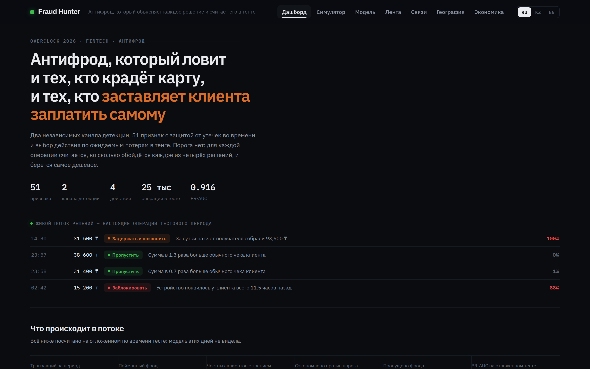
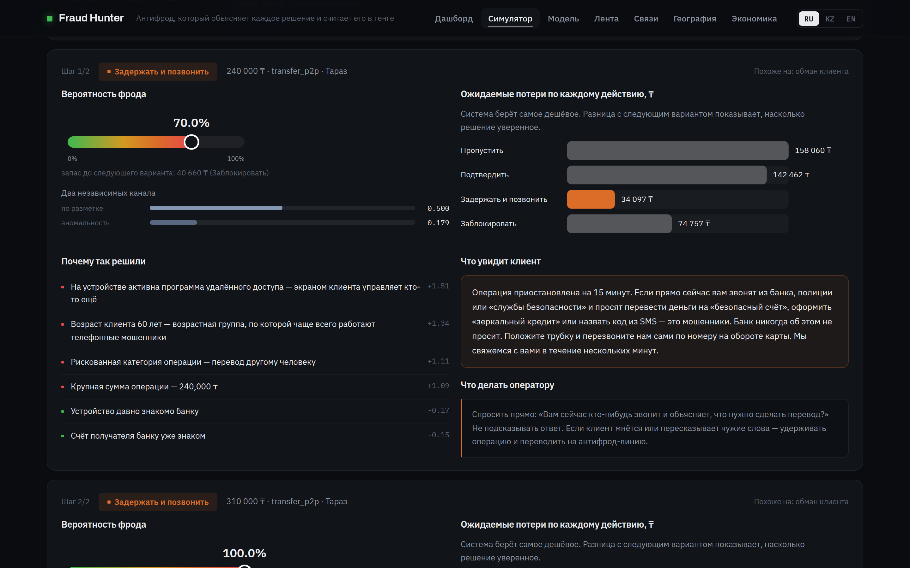
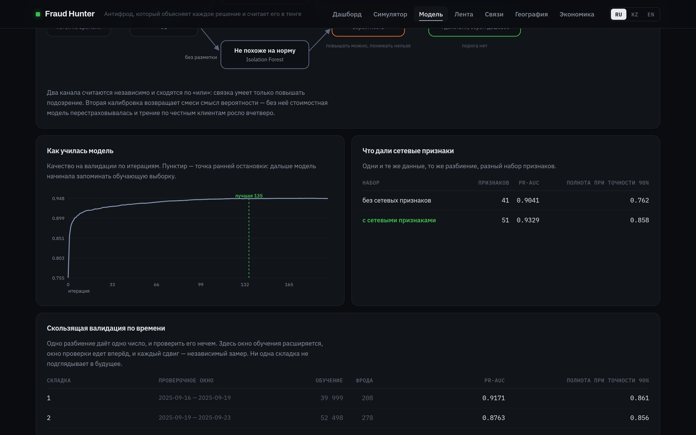
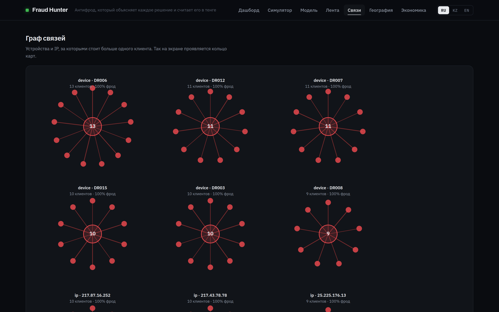
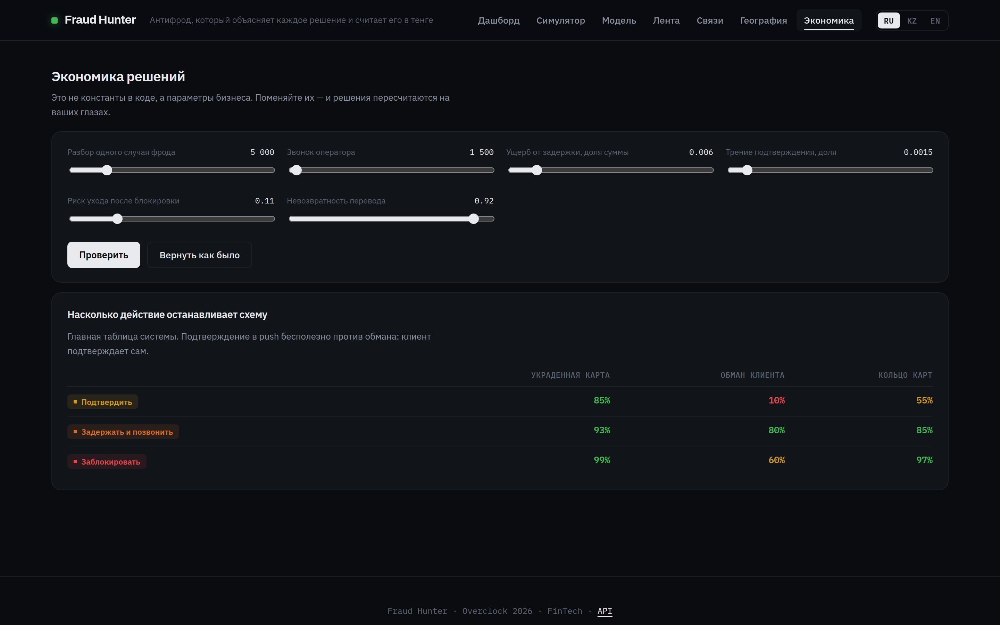

<picture>
  <source media="(prefers-color-scheme: dark)" srcset="docs/img/logo.png">
  
</picture>

[](https://render.com/deploy?repo=https://github.com/diawx-6669/overclock-)

Антифрод-система для финтеха, обрабатывающего 100 000 транзакций в месяц.
Хакатон Overclock 2026, трек FinTech.

Система ловит мошенничество, старается не мешать честным клиентам и объясняет
каждое своё решение — оператору, дата-сайентисту и самому клиенту.

```bash
pip install -r requirements.txt && make all && make run
```



**Содержание.**
[Коротко](#коротко) ·
[Чем отличается](#чем-эта-система-отличается) ·
[Два канала детекции](#два-канала-детекции) ·
[Результаты](#результаты) ·
[Эксплуатация](#эксплуатация) ·
[Как запустить](#как-запустить) ·
[Данные](#данные) ·
[Как устроено](#как-это-устроено) ·
[API](#api) ·
[Интерфейс](#интерфейс) ·
[Развёртывание](#развёртывание)

---

## Коротко

| | |
|---|---|
| PR-AUC на скользящей валидации | **0.900** (разброс 0.876 – 0.917 по 4 складкам) |
| Полнота при точности 90% | **0.858** |
| Реакция на фрод | **94.3%** при трении у 3.41% честных операций |
| Потери за тестовый период | **7.1 млн ₸** против 12.3 млн у лучшего фиксированного порога |
| Решение занимает | **11 мс** вместе с объяснением |
| Проверок | **85** |

Всё это воспроизводится шестью командами и показано на сайте во вкладке
«Модель» — не пересказом, а теми же числами.

---

## Чем эта система отличается

### 1. Она ловит два вида мошенничества, а не один

Почти все антифрод-системы построены вокруг одного сценария: **чужой человек
платит за клиента**. Украли карту или угнали аккаунт — появляется новое
устройство, другой город, VPN, всплеск операций. Такое ловится правилами.

Но есть второй сценарий, и в Казахстане он сегодня основной: **клиента
обманывают, и он платит сам**. Звонок «из банка», «ваш счёт под угрозой»,
«переведите на безопасный счёт», удалённый доступ к телефону, перевод под
диктовку. Операция идёт со своего устройства, из своего города, без VPN,
руками самого клиента, с корректным паролем и подтверждением.

Формально придраться не к чему. Обычная система такое пропускает.

Fraud Hunter различает эти схемы и знает, что против них работают **разные
действия**. Push-подтверждение отлично останавливает чужого человека с
украденной картой — у него просто нет телефона клиента. И почти бесполезно
против обмана: клиент под влиянием мошенника подтвердит операцию сам.
Разорвать такую схему может только пауза и живой разговор с оператором.

На отложенном тесте это видно прямым счётом: из 185 случаев социальной
инженерии система отправила на звонок оператора **170**, а заблокировала
**ноль**. Из 183 краж карты — заблокировала **125**.

### 2. У неё нет фиксированного порога

Обычно антифрод устроен так: есть вероятность фрода и есть порог. Выше —
блокируем, ниже — пропускаем. Порог один на всех, и он всегда неверный: для
перевода на 3 000 000 ₸ он слишком мягкий, для оплаты кофе за 900 ₸ слишком
жёсткий.

Fraud Hunter порог не выбирает. Для каждой транзакции он считает, **во сколько
тенге обойдётся каждое из четырёх действий**, и берёт самое дешёвое:

| Действие | Что это | Против чего работает |
|---|---|---|
| Пропустить | ничего не делаем | — |
| Подтвердить | push или 3-D Secure | кража карты 85%, кольца 55%, обман 10% |
| Задержать и позвонить | пауза плюс оператор с антифрод-скриптом | обман 80%, кража 93%, кольца 85% |
| Заблокировать | операция не проходит | кража 99%, кольца 97%, обман 60% |

Последняя строка — не опечатка. Блокировка отсекает чужого человека начисто, но
жертву обмана не спасает: она остаётся под влиянием мошенника, и ей скажут
«банк сломался, переведите через другой» или отправят в отделение с наличными.
Поэтому против социальной инженерии разговор эффективнее отказа — и стоимостная
модель приходит к этому сама, без единого «если».

Одна и та же вероятность 25% приводит к разным действиям: для покупки на 3 000 ₸
это «пропустить», для перевода на 2 000 000 ₸ — «задержать и позвонить».
Граница двигается вместе с суммой, типом операции и ценностью клиента.

### 3. Объяснение на трёх уровнях

Решение читают три разных человека, и каждому нужно своё:

1. **Вклады SHAP** — дата-сайентисту. Числа, которые можно проверить.
2. **Причины словами** — оператору. «Сумма в 12 раз больше обычной»,
   «устройство появилось 4 минуты назад», «за сутки на счёт получателя собрали
   240 000 ₸». Показываются и доводы *против* клиента, и доводы *за* него —
   иначе объяснение превращается в оправдание.
3. **Сообщение клиенту** — на русском, казахском и английском.



Слева — из чего сложилось решение, справа — во сколько обойдётся каждое из
четырёх действий и что именно увидит клиент. Одна операция, один экран, три
адресата.

Для жертвы социальной инженерии третий пункт и есть главная функция системы.
Формальное «операция отклонена по соображениям безопасности» человека не
спасёт: мошенник тут же объяснит, что банк глючит. Спасает прямая фраза:

> Операция приостановлена на 15 минут. Если прямо сейчас вам звонят из банка,
> полиции или «службы безопасности» и просят перевести деньги на «безопасный
> счёт», оформить «зеркальный кредит» или назвать код из SMS — это мошенники.
> Банк никогда об этом не просит. Положите трубку и перезвоните нам сами по
> номеру на обороте карты.

### 4. Контрфакты: что надо было сделать иначе

SHAP отвечает на вопрос «почему система так решила». Но у оператора и клиента
вопрос обычно другой — «а что надо было иначе», и вклад признака на него не
отвечает. Контрфакт отвечает прямо:

> Если бы сумма не превышала 129 400 ₸, решение было бы другим
> С привычного устройства клиента хватило бы подтверждения в приложении

Такую фразу можно сказать клиенту вслух, и она не требует от него понимать,
что такое вклад признака в логарифм шансов.

Ищем только по полям, которые человек может осознать: сумма, VPN, удалённый
доступ, звонок перед операцией, устройство, город, получатель. Перебирать все
пятьдесят один признак бессмысленно — «уменьшите долю ночных операций за
последние тридцать дней» не совет, а издевательство. По сумме идёт двоичный
поиск границы, остальное — одиночные переключения. Если смягчить нечем,
система говорит и это: пустой список без объяснения оператору бесполезен.

---

## Два канала детекции

Главное возражение к любому антифроду на разметке: «вы ловите то, что уже
случалось». Возражение справедливое, и отвечать на него надо замером.

В системе два канала. Первый — LightGBM по разметке, отвечает «похоже на
известное мошенничество». Второй — Isolation Forest без разметки, отвечает
«не похоже на нормальное поведение». Второй слабее на знакомых схемах, и его
работа не в этом: он не знает меток и потому не слепнет на схеме, которой в
обучении не было.

**Замер** (`python -m ml.report`). Берём один вид мошенничества и полностью
вычёркиваем из обучения: метки обнуляем, будто банк про такую схему ничего не
знает. Смотрим, сколько её поймает каждый канал при одинаковой нагрузке на
операторов — тревога по 2% потока:

| Спрятанная схема | Только модель | Два канала, медиана | Разброс по 5 зёрнам |
|---|---|---|---|
| Обман клиента | 0.5% | **35.1%** | 18.9 – 40.5% |
| Кольцо карт | 15.6% | **40.6%** | 31.2 – 50.0% |
| Украденная карта | 29.5% | 23.5% | 23.0 – 26.8% |

Первая строка и есть ответ на возражение: незнакомую социальную инженерию
модель с учителем не видит вообще, а связка ловит больше трети. Третья строка
объясняет, почему вклад канала ограничен потолком: кража карты — единственная
схема, где обучение с учителем сильнее поиска аномалий, и пускать второй канал
в полную силу значит разменивать знакомое на незнакомое.

**Почему медиана, а не одно число.** Isolation Forest строит деревья на
случайных подвыборках, и результат зависит от зерна сильнее, чем хотелось бы:
по одной и той же схеме полнота гуляла от 18.9% до 46.5%. Сначала в README
стояло 42.7% — одиночный прогон, поданный как результат. Теперь все замеры
канала усредняются по пяти зёрнам, а разброс показывается рядом с медианой.

**Чего это стоит.** Страховка не бесплатна: на знакомых схемах она снижает
PR-AUC с 0.933 до 0.917. Потолок вклада канала подобран перебором:

| Потолок | PR-AUC знакомых | Незнакомая схема (медиана) |
|---|---|---|
| выключен | 0.933 | 0.5% |
| 0.10 | 0.925 | 1.1% |
| 0.15 | 0.920 | 7.0% |
| **0.20** | **0.917** | **35.1%** |
| 0.30 | 0.908 | 37.8% |
| 0.50 | 0.893 | 57.8% |

Ниже 0.15 страховка не срабатывает, выше 0.30 платишь больше и не получаешь
почти ничего. Канал отключается флагом `--no-anomaly`.

**Две ошибки, которые пришлось исправить по дороге.** Обе выглядели
правильными.

Сначала каналы сводились обученной логистической регрессией: пусть данные сами
решат вес. Так делать нельзя. Регрессия учится на размеченной валидации, где
спрятанная схема помечена как «не фрод» — её просят подобрать вес для
распознавания того, что ей назвали нормой. Она обнуляла канал аномалий, а на
кольцах давала отрицательный вес: полнота падала с 15.6% до 3.1%, то есть
смесь работала хуже одной модели. Заменено на связку «или», которая умеет
только повышать подозрение и никогда не понижать.

Затем связка «или» сломала калибровку: она считает каналы независимыми, а они
смотрят на одни и те же признаки. Вероятность систематически завышалась,
стоимостная модель принимала завышенное число за настоящее и
перестраховывалась — трение по честным клиентам выросло с 2.7% до 14.4%.
Лечится вторым проходом изотонической регрессии. Преобразование монотонное,
поэтому порядок операций по подозрительности не меняется и страховка
продолжает работать, а шкала снова становится честной.

---

## Результаты

Все числа ниже показаны на сайте во вкладке «Модель» — теми же графиками, из
того же `models/metrics.json`, который собирает обучение.



### Скользящая валидация по времени

Одно разбиение на обучение и тест даёт одно число, и проверить его нечем:
попади в тестовое окно на десяток колец больше — и доля по кольцам изменится
на пятнадцать пунктов. Поэтому основные метрики считаются скользящей
валидацией: окно обучения расширяется, окно проверки едет вперёд, каждый
сдвиг — независимый замер, и ни одна складка не подглядывает в будущее.

| Складка | Проверочное окно | Обучение | Фрода | PR-AUC | Полнота при точн. 90% |
|---|---|---|---|---|---|
| 1 | 16.09 – 19.09 | 40 000 | 208 | 0.917 | 0.861 |
| 2 | 19.09 – 23.09 | 52 500 | 278 | 0.876 | 0.856 |
| 3 | 23.09 – 27.09 | 65 000 | 160 | 0.899 | 0.819 |
| 4 | 27.09 – 01.10 | 77 500 | 240 | 0.900 | 0.912 |
| | **медиана** | | **886** | **0.900** | **0.858** |

В проверочные окна попало 886 фродовых операций против ~500 в одном окне.
По видам, доля с вероятностью выше 0.5:

| Схема | Медиана | Разброс | Складок |
|---|---|---|---|
| Украденная карта | 0.800 | 0.768 – 0.864 | 4 |
| Обман клиента | 0.888 | 0.729 – 0.921 | 4 |
| Кольцо карт | 0.875 | 0.800 – 0.929 | 3 |

### На основном разбиении

| Метрика | Значение |
|---|---|
| ROC-AUC | 0.994 |
| PR-AUC | 0.916 (базовый уровень 0.016) |
| PR-AUC без страховки от новых схем | 0.933 |
| Brier после калибровки | 0.0028 |
| Угадан вид схемы | 99.0% |

| Что делает система | Значение |
|---|---|
| Отреагировала на фрод | 94.3% |
| Честных операций с трением | 3.41% |
| Потери за тестовый период | 7.1 млн ₸ |
| Без системы | 36.0 млн ₸ |
| С лучшим фиксированным порогом | 12.3 млн ₸ |

**Экономия против фиксированного порога — 5.1 млн ₸ за 25 000 операций.**
Порог для сравнения подбирался на валидации, а не на тесте: иначе сравнение
было бы нечестным в нашу пользу.

| Схема | В тесте | Поймано | Что система выбрала |
|---|---|---|---|
| Украденная карта | 183 | 95.6% | блокировка 125, подтверждение 31, звонок 19 |
| Обман клиента | 185 | 91.9% | **звонок 170**, блокировок 0 |
| Кольцо карт | 32 | 100% | блокировка 26, звонок 2, подтверждение 4 |

Колец в этом окне всего 32 — доля по ним шумная, опираться стоит на цифры
скользящей валидации выше.

### Что дали сетевые признаки

Абляция на одних и тех же данных и том же разбиении:

| Набор | PR-AUC | Полнота при точности 90% |
|---|---|---|
| 41 признак, без сетевых | 0.904 | 0.762 |
| 51 признак, с сетевыми | **0.933** | **0.858** |

### Устойчивость к ошибке в стоимостной модели

Матрица эффективности действий взята из отраслевых оценок: измерить её на
своём потоке можно только A/B-тестом. Честный ответ на это — не оправдание,
а замер. Портим параметр и смотрим, насколько наши решения хуже тех, что мы
приняли бы, зная правду:

| Что меняем | Решений изменилось | Цена ошибки |
|---|---|---|
| Эффективность действий −25% | 0.8% | 0.30% |
| Эффективность действий +25% | 0.9% | 3.43% |
| Разбор случая ×2 | 0.6% | 0.09% |
| Звонок оператора ×2 | 0.3% | 0.67% |
| Риск ухода после блокировки ×2 | 0.1% | 0.51% |
| Невозвратность перевода 0.92 → 0.70 | 0.2% | 0.28% |

Даже при ошибке в матрице на четверть меняется меньше процента решений, а
цена ошибки не превышает 3.5%. Спор о том, 85 там процентов или 80, на выбор
действия почти не влияет.

Цена ошибки считается в ожидаемых потерях, а не в фактических. Правило
выбирает действие по ожидаемым потерям, и сравнивать его с идеальным правилом
нужно в той же величине: на фактических исходах конечной выборки нашему
правилу может просто повезти, и величина выходит отрицательной, чего не
бывает. Первый прогон дал как раз такие минусы — это был признак неверно
поставленного вопроса.

### Сколько система думает над операцией

Авторизация карты укладывается в сотни миллисекунд на весь путь, и антифрод —
только часть этого пути.

| Этап | p50 |
|---|---|
| Сборка признаков | 0.6 мс |
| Обе модели | 8.8 мс |
| Расчёт ожидаемых потерь | 0.05 мс |
| Объяснение (SHAP) | 1.6 мс |
| **Всего** | **11.1 мс** |

Один процесс выдерживает около 320 000 операций в час при месячном потоке
кейса в 100 000.

Замер окупился сразу. Сначала путь занимал 23.3 мс, и восемьдесят процентов
этого времени уходило на обход Isolation Forest из трёхсот деревьев. Проверка
показала, что триста деревьев не покупают ничего: ROC-AUC канала 0.930 против
0.934 у ста. Без разбивки по этапам это место осталось бы незамеченным — общее
число выглядело приемлемым.

---

## Эксплуатация

### Нагрузка на операторов

Стоимостная модель считает звонок статьёй расходов в полторы тысячи тенге и на
этом останавливается. Но оператор — это человек в смене, а не строка в смете.

| | |
|---|---|
| Звонков в месяц на 100 000 операций | 1 312 |
| Операторов при шестиминутном звонке и восьмичасовой смене | 0.55 |
| Выгода на один звонок | 55 078 ₸ при стоимости 1 500 ₸ |

Интереснее другое — **концентрация выгоды в очереди**. Верхние 10% звонков
несут 42% всех сэкономленных денег, верхние 20% — 63%. Это ответ на нехватку
людей: звонить надо по убыванию ожидаемой выгоды, а не по времени поступления.
Операция, где звонок экономит девятьсот тысяч, должна обойти ту, где он
экономит восемь, даже если пришла позже.

### Мониторинг дрейфа и контур переобучения

Дрейф бывает двух видов, и путать их дорого. **Сдвиг данных** — поток стал
другим, модель видит не то, на чём училась; меряем PSI по каждому признаку.
**Сдвиг качества** — вероятности перестали соответствовать реальности; это
опаснее, потому что стоимостная модель считает потери именно по вероятности,
и все решения тихо разъезжаются.

Первый прогон дал шесть признаков со значимым сдвигом — и все шесть оказались
ложной тревогой. `device_age_days`, `history_len`, `component_size` растут по
ходу потока просто потому, что у клиента прибавляется истории. Это не дрейф
модели, это разогрев состояния.

Исправлено двумя вещами. Сравниваем два соседних окна равной длины, а не весь
обучающий период против тестового: иначе в сравнение попадает начало месяца,
когда истории нет вообще. И накопительные признаки помечены явным списком.

| | |
|---|---|
| Признаков, обязанных быть стабильными | 37 |
| Из них со сдвигом | **0** |
| Расхождение предсказанной и фактической доли фрода | +0.0008 и +0.0021 по неделям |

Это не косметика: если дежурный каждый день видит шесть красных признаков,
красных по построению, он перестаёт смотреть на список вообще — и пропустит
седьмой, настоящий.

Мониторинг — не отчёт, а контур с выходом. `python -m ml.drift --fail-on-drift`
возвращает ненулевой код, если признаки, обязанные быть стабильными, значимо
сдвинулись или калибровка разошлась больше чем на 0.006. Такую модель нельзя
катить дальше без переобучения, и сборка это знает.

---

## Как запустить

```bash
pip install -r requirements.txt
python -m ml.generate_data     # 100 000 транзакций, ~5 секунд
python -m ml.train             # обучение и метрики, ~25 секунд
python -m ml.report            # абляция, устойчивость, эксперименты, ~50 секунд
python -m ml.walkforward       # скользящая валидация, ~40 секунд
python -m ml.bench             # замер задержки, ~10 секунд
python -m ml.drift             # мониторинг дрейфа, ~10 секунд
uvicorn backend.main:app --reload
```

Короче: `make all && make run`. Открыть http://localhost:8000, документация
API — http://localhost:8000/docs

```bash
make test        # 85 проверок
make demo        # dist/demo.html — статичная витрина без сервера
```

Проверки написаны не ради числа: почти каждая закрывает ошибку, которая уже
случилась в этом проекте.

| Файл | Проверок | Что стережёт |
|---|---|---|
| `test_api.py` | 27 | ответы всех ручек, песочница скоринга, границы ползунков экономики |
| `test_cost.py` | 14 | выбор действия по ожидаемым потерям, влияние суммы и вида схемы |
| `test_counterfactual.py` | 12 | контрфакт объясняет то же решение, что принято по серии |
| `test_features.py` | 11 | офлайн и онлайн считают признаки одинаково, будущее не протекает |
| `test_data.py` | 9 | генератор воспроизводим при разных `PYTHONHASHSEED` |
| `test_anomaly.py` | 6 | связка каналов только повышает подозрение, калибровка не ломается |
| `test_drift.py` | 6 | накопительные признаки не поднимают ложную тревогу |

Весь конвейер воспроизводим до последнего знака: генератор и LightGBM работают
с фиксированными сидами, многопоточная недетерминированность LightGBM отключена
флагами `deterministic` и `force_row_wise`, а в генераторе нет встроенного
`hash()` — он солится заново в каждом процессе и делал датасет разным при одном
и том же сиде. Два запуска в разных процессах дают побайтово одинаковые данные
и одинаковые метрики; это закреплено тестом.

---

## Данные

Реального датасета у задачи нет, поэтому месяц работы финтеха генерируется:
3 000 клиентов, 100 000 транзакций, 1.79% фрода.

Именно поэтому генератор писался не как заглушка. Главный принцип — **честные
клиенты тоже шумят**. Они ездят в отпуск, покупают новые телефоны, платят
ночью, изредка тратят десять своих средних чеков, пользуются VPN, переводят
круглые суммы незнакомым людям и созваниваются перед переводом. Примерно 1%
честных операций выглядит ровно так, как в учебнике описан мошенник:

- человек улетел в командировку с новым телефоном и платит из Дубая через VPN;
- человек сам, добровольно, переводит крупную круглую сумму незнакомому
  получателю после долгого звонка — покупка машины с рук, ремонт, помощь
  родственнику.

Это не украшение. Первая версия генератора была «чистой», и модель показывала
PR-AUC 0.98 — на одном признаке «круглая сумма», потому что честные суммы
округлялись до десятков, а мошеннические до десятков тысяч. Такая модель
рассыпалась бы на реальных данных в первый же день.

Три схемы мошенничества:

- **stolen_card** (45%) — из них около 40% работают «тихо»: своя страна, без
  VPN, суммы почти обычные, обычный маркетплейс. Правило «заграница плюс новое
  устройство» их не видит;
- **social_eng** (35%) — чаще по клиентам старше 50, со своего устройства, из
  своего города, часто дробится на 2–4 перевода. Дроп-счета переиспользуются
  между жертвами: счёт живёт несколько дней, через него проходят десятки
  переводов, потом его блокируют и берут следующий;
- **fraud_ring** (20%) — кольца из 6–15 карт; часть участников заходит с общего
  устройства и IP, часть со своих.

Чтобы признак «много отправителей» не превратился в готовый ответ, в честном
потоке есть популярные получатели — арендодатели, репетиторы, мастера,
небольшие магазины без эквайринга. На их счета тоже приходят переводы от многих
разных людей за сутки, и различать приходится по другим признакам.

---

## Как это устроено

```
ml/common.py          справочники: города, категории, расстояния
ml/generate_data.py   генератор 100 000 транзакций
ml/features.py        признаки — один код для обучения и онлайна
ml/anomaly.py         второй канал: поиск аномалий без учителя
ml/train.py           обучение, калибровка, метрики, сравнение в деньгах
ml/report.py          абляция, подбор потолка, устойчивость, новая схема
ml/walkforward.py     скользящая валидация по времени
ml/bench.py           замер задержки по этапам
ml/drift.py           мониторинг дрейфа и контур переобучения
backend/cost.py       выбор действия по ожидаемым потерям
backend/explain.py    SHAP → причины словами → сообщение клиенту (RU/KZ/EN)
backend/counterfactual.py  что надо было сделать иначе
backend/main.py       FastAPI: скоринг, дашборд, лента, граф, карта
frontend/index.html   весь интерфейс: один файл, чистый JS и SVG, без сборки
scripts/export_demo.py  статичная витрина одним HTML-файлом
tests/                85 проверок
```

### Признаки

51 признак: деньги, время и скорость, устройство, гео, сеть, поведение в
сессии, торговая точка, клиент.

Два решения, на которых держится вся конструкция.

**Один код для обучения и онлайна.** Признаки считает функция
`compute_features` — и при обучении на 100 000 строк, и при онлайн-запросе к
API. Если офлайн и онлайн разойдутся хоть на один признак, модель в проде будет
работать не так, как на валидации, и заметить это по метрикам практически
невозможно. Есть тест, который проверяет совпадение двух путей до последнего
знака.

**Поток, а не таблица.** Транзакции обрабатываются строго по времени: сначала по
накопленному состоянию считаются признаки, и только потом состояние
обновляется этой транзакцией. Значит, ни один признак не видит будущего.

Самые полезные признаки — сетевые, и они добавлены не наугад. Накопительный
счётчик «сколько разных клиентов переводили этому получателю» за месяц
размывается: у популярного магазина он большой и у дроп-счёта большой. Разница
в том, что к дропу двадцать человек приходят **за сутки**. Поэтому считаем в
окне.



Плюс связная компонента графа «клиент — устройство — IP — получатель» через
union-find. Кольцо не всегда сидит на одном телефоне: участник A делит
устройство с B, B выходит с того же IP, что C, — попарные счётчики такую
цепочку не видят, обход компоненты видит. Кольцо из восьми карт, у которых нет
ни общего устройства, ни общего IP, а связь только через получателя,
компонента объединяет целиком; это закреплено тестом.

### Модели

- **«Это фрод?»** — LightGBM, бинарная классификация.
- **«Какая это схема?»** — LightGBM, три класса, учится только на фродовых
  операциях. От вида схемы зависит, какое действие сработает.
- **«Не похоже на нормальное поведение?»** — Isolation Forest без разметки,
  страховка от схем, которых не было в обучении.
- **Калибровка** — изотоническая регрессия на валидации. Без неё стоимостная
  модель считала бы ожидаемые потери по числу, которое вероятностью только
  притворяется. На дашборде есть кривая надёжности.

### Экономика

Все параметры стоимостной модели — это параметры бизнеса, а не константы кода.
Их видно на вкладке «Экономика», их можно двигать ползунками, и решения
пересчитываются сразу.



Проверить тезис можно руками. На сценарии «Звонят из банка» при базовой
стоимости звонка 1 500 ₸ обе операции уходят в «задержать и позвонить».
Поднимите стоимость звонка до 58 000 ₸ — и звонок исчезает совсем: обе операции
становятся блокировкой, потому что звонить стало дороже, чем потерять клиента.
На «тихой краже» перелом наступает гораздо раньше, при 4 900 ₸: там звонок
держался на куда меньшем перевесе. Обратная проверка тоже работает — поднимите
риск ухода клиента после ложной блокировки, и система при той же дорогой
телефонии вернётся к звонку.

Ни одно правило при этом не меняется — меняется только цена действия. Это и
есть проверка, что решение принимает экономика, а не зашитый порог. Границы
ползунков закрыты тестом: если шкала перестанет дотягиваться до точки перелома,
`tests/test_api.py` упадёт, и документация не разойдётся с интерфейсом.

Учитываются: невозвратность денег по типу операции, стоимость разбора случая,
операционные расходы на действие, трение для честного клиента (растущее вместе
с суммой — задержать оплату кофе и задержать платёж за квартиру это разные
вещи), потерянная маржа и риск ухода клиента после ложной блокировки,
пропорциональный его пожизненной ценности.

---

## API

| Метод | Ручка | Назначение |
|---|---|---|
| POST | `/api/score` | оценить транзакцию, вернуть решение и объяснение |
| POST | `/api/score-sequence` | проиграть серию операций, как в реальном времени |
| POST | `/api/counterfactual` | что надо было изменить, чтобы решение стало мягче |
| POST | `/api/observe` | учесть транзакцию в истории клиента |
| GET | `/api/stats` | агрегаты для дашборда |
| GET | `/api/metrics` | метрики последнего обучения |
| GET | `/api/report` | абляция, подбор потолка, устойчивость, новая схема |
| GET | `/api/walkforward` | скользящая валидация по складкам |
| GET | `/api/capacity` | нагрузка на операторов и концентрация выгоды |
| GET | `/api/drift` | мониторинг дрейфа и вердикт контура |
| GET | `/api/bench` | замер задержки по этапам |
| GET | `/api/feed` | лента решений |
| GET | `/api/graph` | граф связей: устройства и IP с несколькими клиентами |
| GET | `/api/map` | география операций |
| GET | `/api/decision-map` | действие для каждой пары «вероятность и сумма» |
| GET | `/api/clients/{id}` | профиль клиента и его последние операции |
| GET | `/api/economics` | текущая стоимостная модель |

`POST /api/score` и `/api/score-sequence` **не меняют** состояние системы:
серия считается в песочнице, которая видит всю накопленную историю, но пишет
только к себе. Один и тот же сценарий на демо всегда даёт один и тот же
результат.

Контрфакты принимают всю серию, а не одну операцию. Это не удобство вызова, а
условие правильности: в серии подозрение накапливается, и решение по третьей
покупке подряд принято с учётом двух предыдущих.

```bash
curl -X POST localhost:8000/api/score \
  -H "Content-Type: application/json" \
  -d '{"client_id":"C00042","amount":850000,"tx_type":"transfer",
       "merchant_category":"transfer_p2p","channel":"mobile_app",
       "remote_access":1,"call_minutes_before":38,"recipient_id":"R77777"}'
```

---

## Интерфейс

Один файл `frontend/index.html`: чистый JavaScript и SVG, ни сборки, ни
фреймворков. Весь интерфейс на трёх языках.

**Дизайн-решение: цвет есть только у решений.** Антифрод-оператор смотрит в
этот экран весь день и ищет глазами одно — что система решила сделать. Если
интерфейс расцвечен синими кнопками, фиолетовыми графиками и брендовыми
акцентами, четыре цвета действий тонут в этом шуме. Поэтому вся обвязка
монохромная: холодный графит, волосяные линии, нейтральные чернила графиков.
Насыщенный цвет в макете ровно один раз — на действии.

Проверка на себе же: в сравнении потерь столбцы сначала были раскрашены
цветами действий, и красный «без системы» стал самым громким пятном страницы,
ничего при этом не означая. Базовые линии перекрашены в нейтральные, выделен
только наш результат — и выделен яркостью, а не цветом.

Шрифты подобраны под предметную область: IBM Plex Sans и Plex Mono рисовались
для корпоративных интерфейсов с плотными таблицами, Archivo даёт заголовкам
характер. Все цифры моноширинные с табличными знаками — иначе колонки сумм
не выстраиваются.

Разделы:

- **Дашборд** — обложка с живым потоком решений, показатели, поток по дням,
  сравнение потерь в деньгах, кривая надёжности вероятностей.
- **Симулятор** — шесть готовых сценариев, включая два честных для проверки на
  ложные срабатывания. Каждый сценарий это *серия* операций: видно, как оценка
  растёт от шага к шагу. Одна изолированная покупка за границей с нового
  устройства — это с равным успехом и кража, и командировка, и система честно
  отвечает «не уверен». Три покупки подряд за двадцать минут — уже другая
  картина.
- **Модель** — схема тракта, настоящая кривая обучения, скользящая валидация,
  абляция признаков, эксперимент со схемой, которой модель не видела,
  устойчивость к ошибке в стоимостной модели, задержка по этапам, нагрузка на
  операторов и мониторинг дрейфа.
- **Лента** — то, что видит дежурный аналитик, с причинами по каждой операции.
- **Связи** — кольца карт: устройства и IP, за которыми стоит больше одного
  клиента.
- **География** — города Казахстана отдельно, заграница отдельно: доля фрода в
  зарубежных операциях на порядок выше.
- **Экономика** — параметры стоимостной модели и матрица эффективности.

---

## Развёртывание

Render, один сервис: FastAPI отдаёт и API, и фронтенд. Кнопка вверху читает
`render.yaml` и заполняет все поля сама.

Данные и модель не хранятся в репозитории: они генерируются и обучаются на
этапе сборки, поэтому модель всегда соответствует текущему коду признаков.

| | Значение | Лимит free-тарифа |
|---|---|---|
| Пик памяти при обучении | 329 МБ | 512 МБ |
| Пик памяти при сборке отчёта | 436 МБ | 512 МБ |
| Память работающего сервиса | 322 МБ | 512 МБ |
| Холодный старт приложения | 2.7 с | — |

Отчёт собирается тремя отдельными процессами: за один отчёт обучается около
десяти моделей, и в общем процессе их пик подбирается к пределу тарифа.
Отдельный процесс на шаг — и система забирает память обратно после каждого.
Если отчёт всё же не соберётся, деплой продолжится: сайт умеет работать без
него.

Free-тариф усыпляет сервис после простоя, поэтому для защиты есть ещё статичная
витрина — она открывается мгновенно:

```bash
python -m scripts.export_demo     # dist/demo.html, один файл без сервера
```

Витрина собирается из того же `frontend/index.html`: скрипт поднимает настоящее
приложение, обходит все ручки и вшивает ответы в страницу. Код интерфейса не
дублируется, поэтому витрина не может разойтись с продуктом по виду и
поведению.

---

## Стек

Python 3.11, pandas, numpy, scikit-learn, LightGBM, SHAP, joblib,
FastAPI, uvicorn. Фронтенд без зависимостей.
